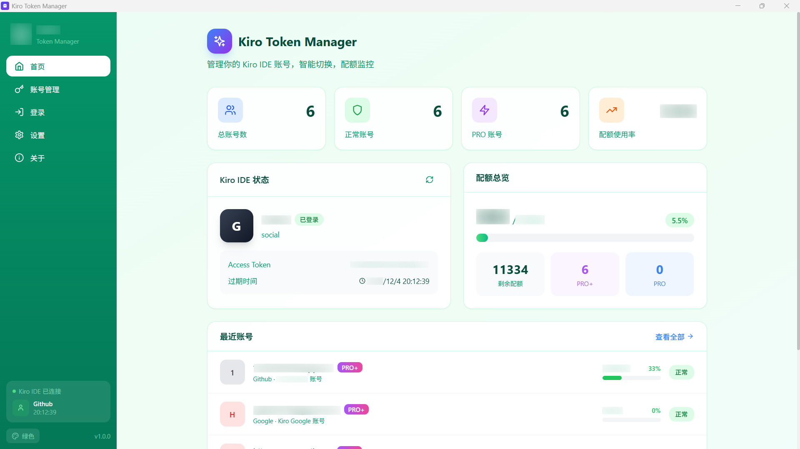
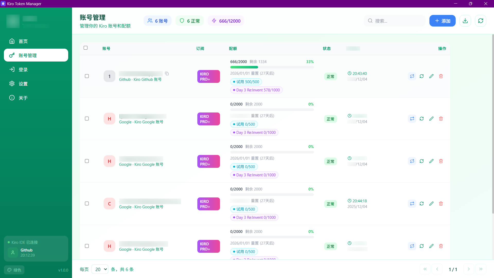
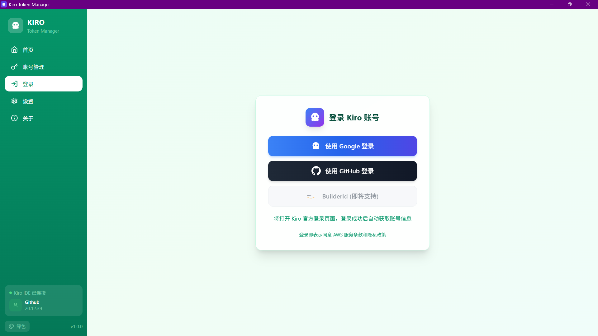
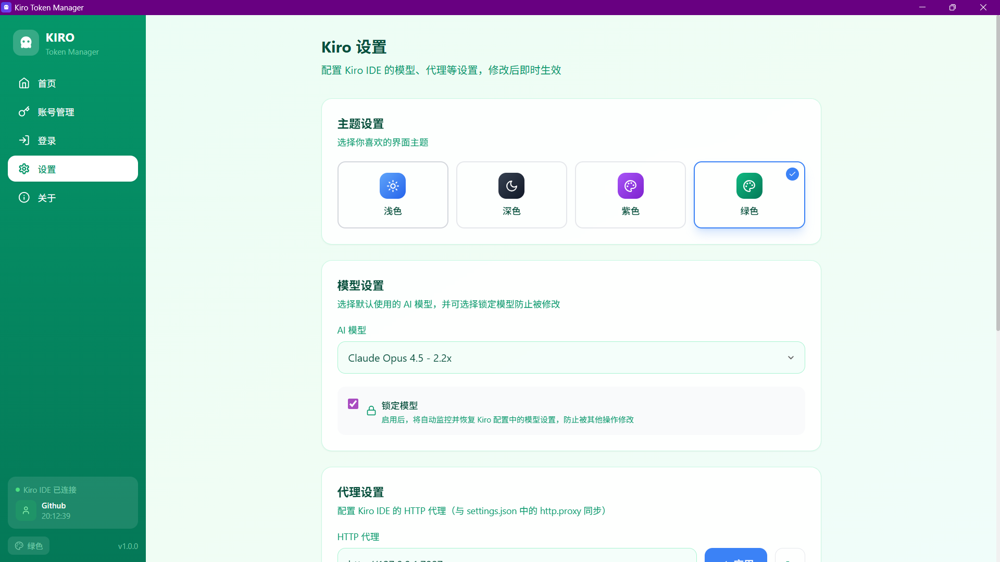
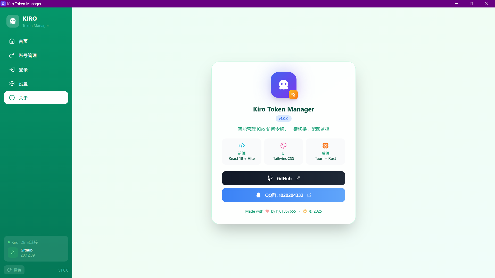

# Kiro Account Manager

  
  
  

  <b>智能管理 Kiro 访问令牌，一键切换，配额监控</b>

---

## ✨ 功能特性

- 🔐 **多账号管理** - 支持 Google、Github 等多种登录方式
- 📊 **配额监控** - 实时查看账号配额使用情况（主配额/试用/奖励）
- 🔄 **一键切换** - 快速切换 Kiro IDE 账号，自动重置机器 ID
- ⚙️ **IDE 设置** - 代理/模型设置同步
- 🎨 **主题切换** - 支持浅色、深色、紫色、绿色主题
- 💾 **数据导出** - 支持账号数据导出备份
- 🔒 **本地存储** - 所有数据本地存储

## 📸 截图

| 首页 | 账号管理 |
|:---:|:---:|
|  |  |

| 登录 | 设置 |
|:---:|:---:|
|  |  |

| 关于 |
|:---:|
|  |

## 📥 下载

👉 **[点击这里下载最新版本](https://github.com/hj01857655/kiro-account-manager/releases/latest)**

| 平台 | 文件类型 | 说明 |
|------|----------|------|
| Windows | `.msi` | 推荐，双击安装 |
| Windows | `.exe` | NSIS 安装程序 |
| macOS | `.dmg` | 拖入 Applications |

## 💻 系统要求

- **Windows**: Windows 10/11 (64-bit)，需要 WebView2 (Win11 已内置)
- **macOS**: macOS 10.15+ (Intel/Apple Silicon 通用)

## 🛠️ 技术栈

- **前端**: React 18 + Vite + TailwindCSS
- **后端**: Tauri 1.x + Rust
- **图标**: Lucide Icons

## 💬 交流反馈

- 💡 问题反馈、功能建议、使用交流
- 🐛 [提交 Issue](https://github.com/hj01857655/kiro-account-manager/issues)
- 💬 QQ 群：[Kiro Account Manager 交流群 (1020204332)](https://qm.qq.com/q/Vh7mUrNpa8)

  

## ⚠️ 免责声明

本软件仅供学习交流使用，请勿用于商业用途。使用本软件所产生的任何后果由用户自行承担。

---

Made with ❤️ by hj01857655

